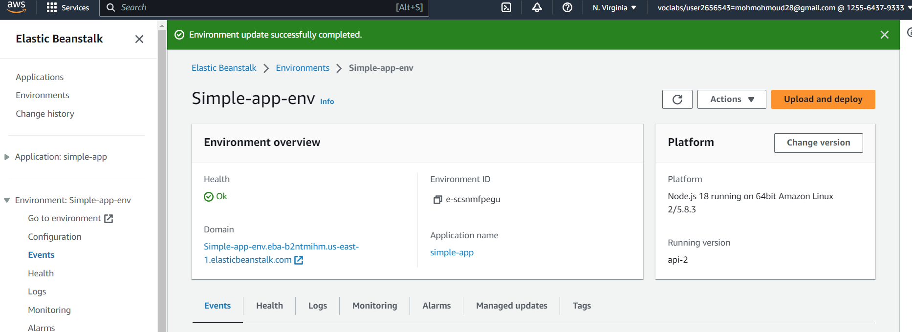
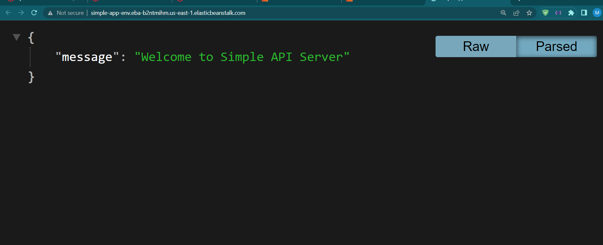

# Cloud-Server 
---
Author : Mohammad Attallah
lab 16 

URL Deploy: [http://simple-app-env.eba-b2ntmihm.us-east-1.elasticbeanstalk.com/](http://simple-app-env.eba-b2ntmihm.us-east-1.elasticbeanstalk.com/)

Pull Request:[URL]()

---
### Description 

In this lab, we deploy a simple node.js application on AWS. 

**AWS**, **Amazon Web Services**, is a leading cloud computing platform offering a wide range of services for building and managing applications. With global infrastructure, pay-as-you-go pricing, and a vast service portfolio, AWS empowers businesses to scale, innovate, and operate efficiently in the digital era. Its secure and flexible environment caters to various industries, making it a preferred choice for cloud solutions worldwide, 

Most of the tools on AWS are not free, but I have a demo account. Unfortunately, the published apps only work when that account is active. However, I did provide screenshots when I published the app

### Steps 

####  AWS Academy

- First, open the AWS Academic and start the lab.
####  AWS Platform
- After starting the lab, open the AWS platform when the button light becomes green.

- Then, open Elastic Beanstalk from the 'Service' menu at the top of the page.

- From the Elastic Beanstalk page, you can do 'Create application'.

####  Create application
- Now, you should submit the information for the app under 'Application information' (*Application name*, *Description*). Tags are not required in this case since we are deploying a simple app.

- After that, create an Environment for the Application.

- Let's press the 'Create new Environment' button.

####  Create Environment

- Now, we have a new page called 'Configure environment'.

- First, select the Environment tier; in this case, select the 'Web server environment'.

- Under 'Application information', use the previous information we submitted before.

- For the Application information in this case, there is no requirement to add anything.

- Select 'Managed platform' for the Platform; in this case, we use 'node.js', and AWS will automatically add Platform branch and Platform version.

- For 'Application code', select 'Upload your code', compress your code in a 'zip file' (*it does not accept another format; an error will appear later if you do*), and then choose any label for your code (*it's for version control*).

#### Configure service access
- 'Presets' refer to preset configurations'

- Now, in 'Configure service access', add the roles for deployment:
    - Existing service roles
    - Lab Role
    - EC2 key pair
    - Vockey
    - LambinstanceProfile

#### Set up networking, database, and tags - optional
- Now, we can skip 'Set up networking, database, and tags - optionalInfo', but if you have a database, you should add all the necessary information; in this case, I will skip and 'skip to review'.
#### Review
- Now, we have information about the environment to review, or if you need to edit something.

- When you press the 'Submit' button, proceed to the Deployment page.

#### Deployment
- The deployment may take some time, but if everything is okay, it should take between 5-10 minutes.

- Finally, you should get a 'Health OK' with a Green light, and of course, a URL for Deployment.

### Screenshot

